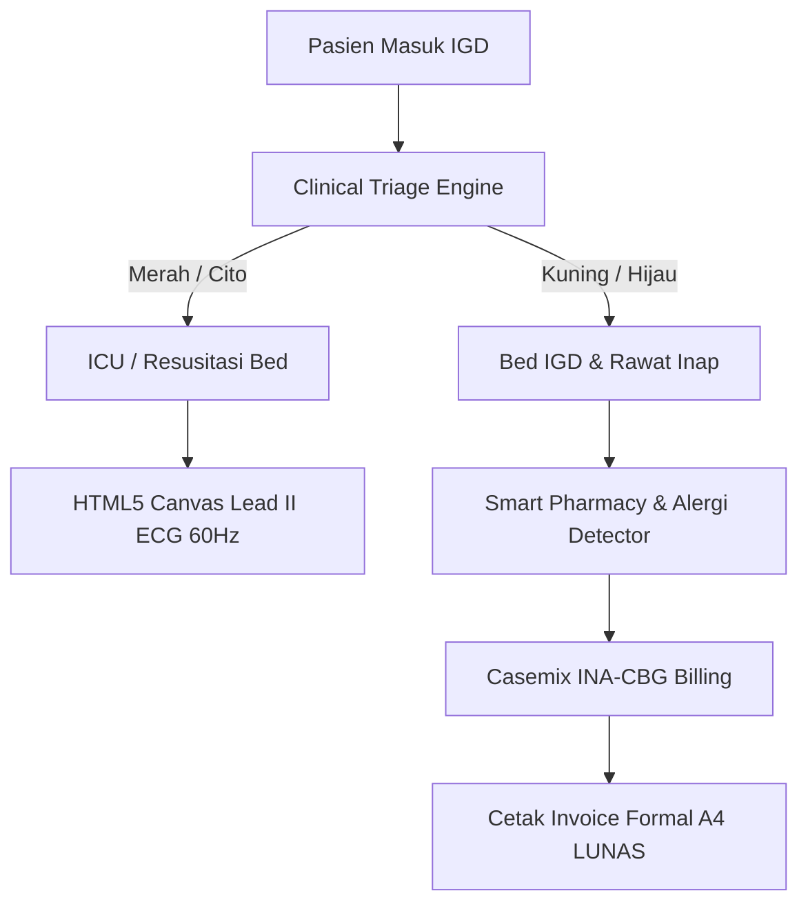

# 🏥 MediCore OS — Hospital ERP, Clinical Triage & E-Prescription (The 9th Titan)

> **Live Demo:** [https://olyxmintabansos-byte.github.io/medicore-os/](https://olyxmintabansos-byte.github.io/medicore-os/)  
> **Clinical Triage & Bed Manager:** [https://olyxmintabansos-byte.github.io/medicore-os/triage/](https://olyxmintabansos-byte.github.io/medicore-os/triage/)  
> **Smart Pharmacy:** [https://olyxmintabansos-byte.github.io/medicore-os/pharmacy/](https://olyxmintabansos-byte.github.io/medicore-os/pharmacy/)  
> **Casemix INA-CBG Billing:** [https://olyxmintabansos-byte.github.io/medicore-os/billing/](https://olyxmintabansos-byte.github.io/medicore-os/billing/)

MediCore OS adalah sistem operasi rumah sakit dan klinik gawat darurat terpadu berarsitektur *client-side local-first*. Memadukan protokol triase klinis 4 tingkat (*Resuscitation, Emergent, Urgent, Non-Urgent*), visualisasi gelombang elektrokardiogram (EKG Lead II 60Hz) berbasis HTML5 Canvas, alokasi bed IGD/ICU/Isolasi/Melati secara interaktif, smart pharmacy dengan deteksi kontraindikasi alergi otomatis, serta rekonsiliasi klaim Casemix INA-CBG dan cetak kuitansi resmi A4.

## 🚀 Fitur Utama
- **Live Lead II ECG Waveform Canvas (`/`)**: Simulasi sinyal elektrokardiogram 60 FPS (P-Q-R-S-T wave) tersinkronisasi tanda vital pasien.
- **Clinical Triage & Bed Allocation (`/triage`)**: Matriks ketersediaan 12 bed di 4 ruang (*IGD, ICU, Isolasi Infeksius, Rawat Inap Melati*) dengan alokasi dan pengosongan bed 1-klik.
- **Smart Pharmacy & E-Resep (`/pharmacy`)**: Validasi otomatis alergi obat terhadap formularium farmasi dan antrean dispensing resep apoteker.
- **Casemix INA-CBG Billing & Print A4 (`/billing`)**: Perhitungan iur bayar BPJS/Asuransi dan cetak kuitansi rincian biaya resmi format A4 (`window.print()`) berstempel LUNAS.

## 🏗️ Diagram Arsitektur

## 🛠️ Tech Stack
- **Framework:** Next.js 16 (App Router), React 19, TypeScript (Strict).
- **Styling:** Tailwind CSS v4, Lucide React, Canvas Confetti.
- **Deployment:** GitHub Pages Static Export (`output: 'export'`, `trailingSlash: true`) with `.nojekyll` bypass.
